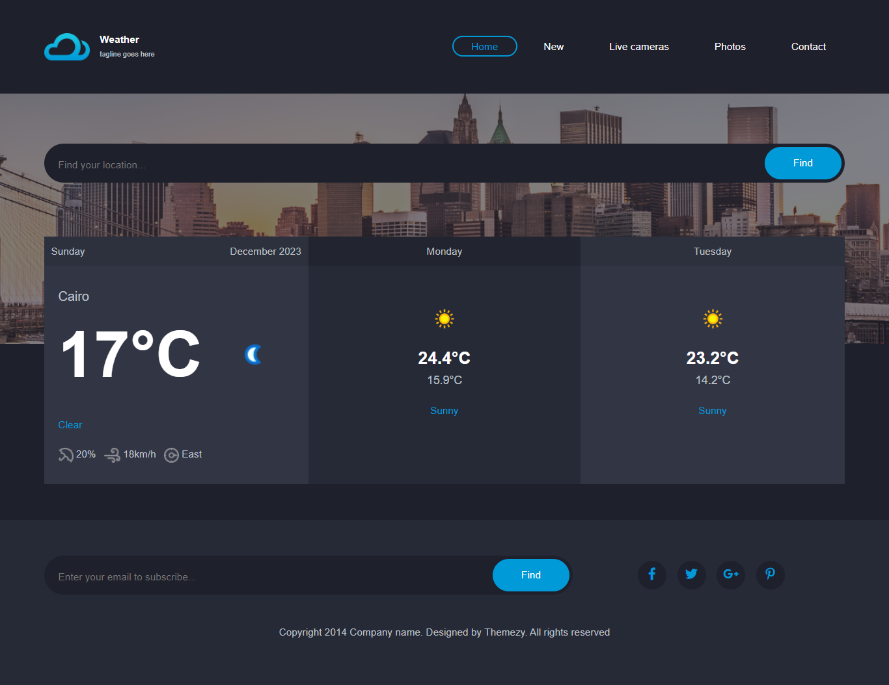

# Weather App

## Project Description

The Weather App is an application that utilizes JavaScript to provide accurate information about current weather conditions and forecasts.

## How the App Works

The application connects to an Application Programming Interface (API) to retrieve current and future weather data. JavaScript is used to analyze this data and present it in an organized and user-friendly manner.

## Features

- Current and future weather forecasts
- Alerts for significant weather changes
- Interactive weather maps

## Technologies Used

- Programming Language: JavaScript
